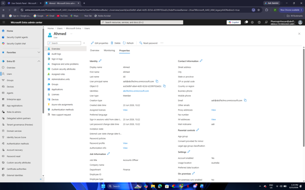
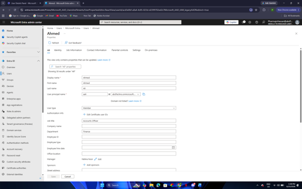
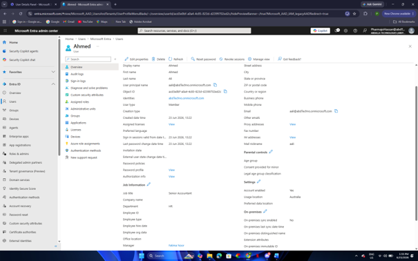
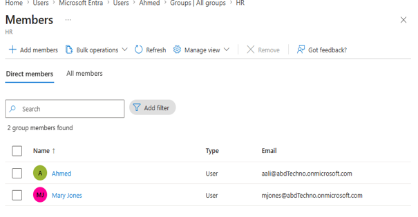
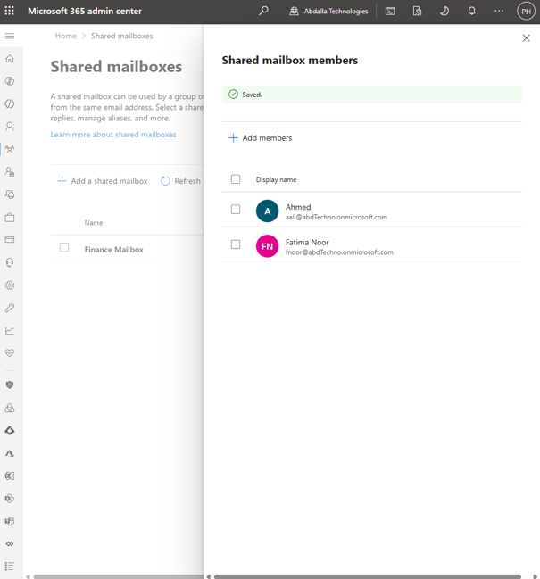
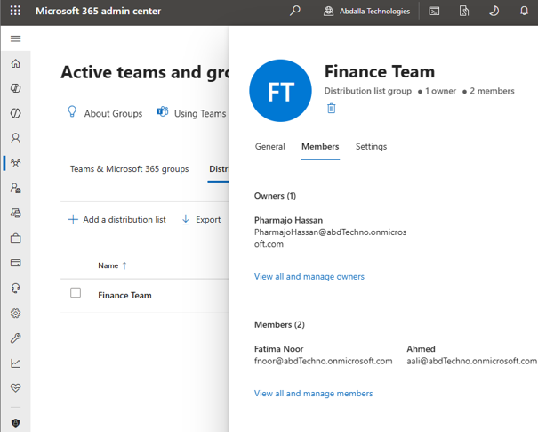
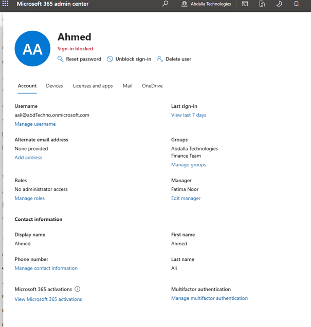
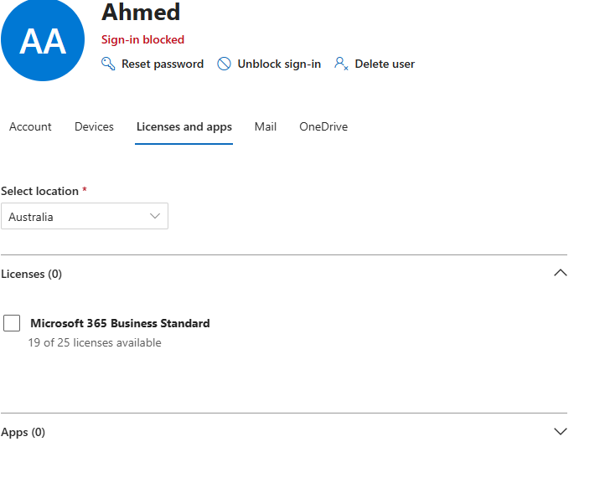
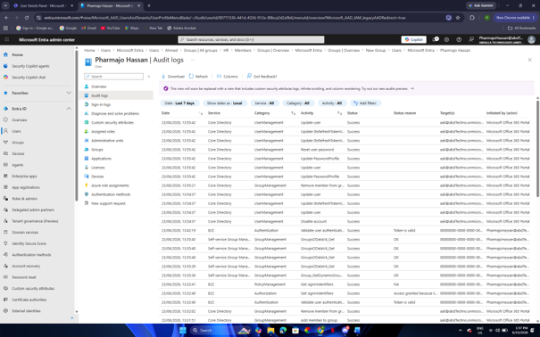

# Microsoft Entra ID User Lifecycle Management

## Overview

This project demonstrates the implementation of user lifecycle management within Microsoft Entra ID for a fictional organisation, **Abdalla Technologies**.

The objective was to simulate common identity administration tasks performed by IT support and systems administrators throughout an employee's lifecycle, including user provisioning, organisational changes, mailbox access, licensing, and secure user offboarding.

The implementation followed standard identity management practices by configuring user accounts, assigning managers, updating departmental information, managing Microsoft 365 collaboration resources, and validating administrative activities through Microsoft Entra ID audit logs.

---

## Technologies Used

- Microsoft Entra ID
- Microsoft 365 Business
- Microsoft Entra Admin Center
- Microsoft 365 Admin Center
- Exchange Online

---

## Business Scenario

Abdalla Technologies is a growing organisation that has recently migrated its identity management to Microsoft Entra ID and Microsoft 365. As the company expands, the IT department is responsible for managing the complete identity lifecycle of employees while ensuring secure access to organisational resources.

A new employee, **Ahmed Ali**, joins the Finance department and requires a Microsoft 365 account, appropriate access permissions, licensing, and reporting structure. Several months later, Ahmed is promoted to the Human Resources department. Following approval from Human Resources and his reporting manager, the IT administrator receives a request to update Ahmed's organisational information, access permissions, and Microsoft 365 resources to reflect his new role.

As part of his new responsibilities, Ahmed is granted access to a shared mailbox and added to the Human Resources distribution list to facilitate collaboration with his new team.

At the end of Ahmed's employment, the IT department follows the organisation's offboarding procedure by removing his Microsoft 365 license, disabling his account, and verifying that all administrative actions are successfully recorded within Microsoft Entra ID audit logs for security and compliance purposes.

---

# Implementation

## 1. User Onboarding and Organisational Assignment

Ahmed Ali's user account was created in Microsoft Entra ID as part of the employee onboarding process. His profile was configured with the identity and organisational information required for his initial role, including his job title and department.

Fatima Noor was then assigned as Ahmed's manager to establish the correct reporting relationship within the organisation.

### Figure 1 – Initial User Profile

Ahmed Ali's Microsoft Entra ID account was created with the organisational attributes required for onboarding, including his display name, user principal name, department (Finance), job title, and initial security group membership.

### Figure 2 – Assigning a Manager

Fatima Noor was assigned as Ahmed Ali's manager, establishing the employee's reporting relationship within Microsoft Entra ID.

---

## 2. Organisational Access Management

Several months after joining Abdalla Technologies, Ahmed Ali was promoted from the Finance department to the Human Resources department. Following approval from Human Resources and his reporting manager, the IT administrator received a request to update Ahmed's organisational information and access permissions to reflect his new role.

As part of the transition, Ahmed's security group membership was updated by removing his previous Finance group assignment and granting membership to the Human Resources group. Updating group memberships ensures users receive access appropriate to their current responsibilities while preventing unnecessary permissions from being retained after role changes.

Ahmed's Microsoft Entra ID profile was then updated to reflect his new department and job title, ensuring organisational information remained accurate across Microsoft 365 services.

### Figure 3 – Updating Group Membership

Following Ahmed Ali's promotion, his security group membership was updated from the Finance group to the Human Resources group, ensuring his access permissions aligned with his new organisational role.

### Figure 4 – Promotion and Department Change

Ahmed Ali's Microsoft Entra ID profile was updated to reflect his promotion and transfer to the Human Resources department, ensuring organisational information remained accurate within the Microsoft 365 environment.

---

## 3. Microsoft 365 Collaboration Management

Following Ahmed Ali's transfer to the Human Resources department, additional Microsoft 365 collaboration resources were configured to support his new responsibilities.

Exchange Online was used to manage shared mailbox permissions and departmental email communication.

Ahmed was granted access to the Human Resources shared mailbox, allowing him to view and manage emails sent to the department. He was also added to the Human Resources distribution list to enable communication with all members of the department through a single email address.

### Figure 5 – Shared Mailbox

Ahmed Ali was granted the appropriate permissions to access the Human Resources shared mailbox, enabling collaboration with other members of the department.

### Figure 6 – Distribution List Membership

Ahmed Ali was added to the Human Resources distribution list to facilitate email communication with members of the Human Resources department.

---

## 4. User Offboarding

Several months after joining the organisation, Ahmed Ali resigned from Abdalla Technologies to pursue a new career opportunity.

Following notification from the Human Resources department, the IT administrator was tasked with completing the employee offboarding process to ensure organisational data and Microsoft 365 resources remained secure.

As part of the offboarding procedure, Ahmed's ability to sign in to Microsoft 365 was disabled to immediately revoke access to organisational resources. Once access had been revoked, the Microsoft 365 Business license assigned to his account was removed, allowing it to be reallocated to another employee.

### Figure 7 – User Account Disabled

Ahmed Ali's sign-in was blocked as part of the organisation's offboarding procedure, preventing further access to Microsoft 365 services and organisational resources.

### Figure 8 – License Removal

The Microsoft 365 Business license assigned to Ahmed Ali was removed, completing the user deprovisioning process and making the license available for reassignment.

---

## 5. Audit Log Review

Following the completion of the user lifecycle, Microsoft Entra ID audit logs were reviewed to verify that the administrative actions had been successfully recorded.

Audit logging provides administrators with visibility into identity-related changes, supporting troubleshooting, security investigations, and compliance requirements.

The audit logs confirmed that the user lifecycle activities—including account modifications and administrative changes—were successfully captured within the Microsoft Entra ID tenant.

### Figure 9 – Audit Logs

Microsoft Entra ID audit logs were reviewed to verify that the administrative actions performed throughout Ahmed Ali's lifecycle were successfully recorded for auditing and compliance purposes.

---

# Outcome

The project successfully demonstrated the complete user lifecycle within Microsoft Entra ID and Microsoft 365, from employee onboarding through organisational changes to secure offboarding.

Throughout the implementation, user identities, organisational information, group memberships, collaboration resources, and account access were managed using Microsoft Entra ID and Exchange Online. Administrative actions were successfully recorded within Microsoft Entra ID audit logs, demonstrating accountability and supporting organisational security and compliance requirements.

This implementation reflects common identity administration tasks performed by IT support and Microsoft 365 administrators in enterprise environments.

---

# Skills Demonstrated

- Enterprise identity lifecycle management
- Microsoft Entra ID administration
- Microsoft 365 user administration
- Identity and Access Management (IAM)
- User onboarding and offboarding
- Organisational identity management
- Security group administration
- Manager assignment and organisational hierarchy
- Shared mailbox administration
- Distribution list management
- Microsoft 365 license management
- Microsoft Entra ID audit log analysis
- Cloud identity administration
