# Case Study 05 - Windows 11 Endpoint Management and Security using Microsoft Intune

## Executive Summary

This project demonstrates the enrolment, configuration, security management, and application deployment of a Windows 11 test device using Microsoft Intune in a simulated business environment.

The implementation included creating Microsoft Entra ID device groups, enrolling a Windows 11 device into Microsoft Entra ID and Mobile Device Management (MDM), verifying the device in the Microsoft Intune admin center, assigning a device configuration profile, creating and assigning a Windows compliance policy, configuring a Microsoft Defender Antivirus policy, deploying Google Chrome as a Win32 application, and creating a Conditional Access policy requiring multi-factor authentication (MFA) for selected administrative roles.

---

## Technologies Used

- Microsoft Intune
- Microsoft Entra ID
- Microsoft Defender Antivirus
- Microsoft 365 Administration
- Windows 11
- VMware Workstation

---

## Business Scenario

Abdalla Technologies required a controlled lab environment to evaluate Microsoft Intune for Windows endpoint administration. A Windows 11 virtual machine named **PRACTICELAB** was used as the test device.

The administrator created device security groups in Microsoft Entra ID and added PRACTICELAB to the **Test Devices** group. The device was then connected to the organisation's Microsoft Entra ID tenant and enrolled into Mobile Device Management (MDM).

After enrolment, the administrator used Microsoft Intune to verify the device, assign configuration and compliance policies, configure Microsoft Defender Antivirus settings, deploy Google Chrome as a Win32 application, and create a Conditional Access policy requiring multi-factor authentication for selected administrative roles.

---

## Environment

| Component | Implementation |
|-----------|----------------|
| Test Device | PRACTICELAB |
| Operating System | Windows 11 |
| Virtualisation | VMware |
| Identity Platform | Microsoft Entra ID |
| Device Management | Microsoft Intune |
| MDM Connection | Abdalla Technologies MDM |
| Device Ownership | Personal |
| Endpoint Protection | Microsoft Defender Antivirus |
| Application Deployment | Google Chrome (Win32 App) |
| Identity Security | Conditional Access with MFA |

---

# Implementation

## 1. Device Group Creation

### Implementation

Before deploying management policies, dedicated Microsoft Entra ID security groups were created to organise Windows devices based on their intended organisational function. This approach enables Microsoft Intune administrators to assign configuration profiles, compliance policies, endpoint security policies, and applications to specific groups rather than managing devices individually.

The following security groups were created:

- Test Devices
- Shared Devices
- IT Devices
- HR Devices
- Finance Devices

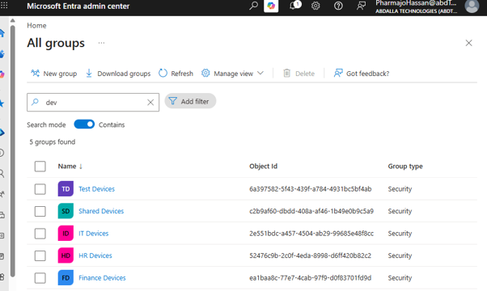

**Figure 1.** Microsoft Entra ID security groups created for Windows device management.

### Validation

The screenshot confirms that the required Microsoft Entra ID security groups were successfully created and are available for assigning devices, policies, applications, and endpoint security configurations.

---

## 2. Windows Device Enrollment and Group Assignment

### Implementation

After creating the Microsoft Entra ID security groups, the Windows 11 virtual machine **PRACTICELAB** was connected to the organisation's Microsoft Entra ID tenant and enrolled into Microsoft Intune Mobile Device Management (MDM).

Device enrolment establishes a trusted relationship between the endpoint and the organisation, enabling administrators to centrally manage configuration, security, applications, and compliance from the Microsoft Intune admin center.

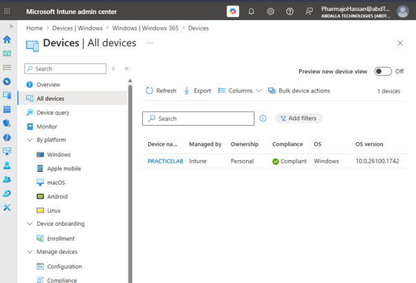

**Figure 2.** PRACTICELAB successfully enrolled into Microsoft Intune.

Following successful enrolment, PRACTICELAB was added to the **Test Devices** Microsoft Entra ID security group.

Using security groups allows Microsoft Intune administrators to deploy configuration profiles, compliance policies, endpoint security settings, and applications to collections of devices rather than managing each device individually. This provides a consistent and scalable method for administering Windows endpoints.

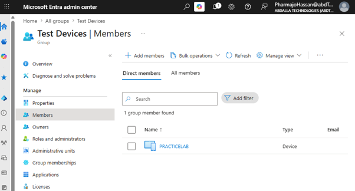

**Figure 3.** PRACTICELAB added to the Test Devices security group.

### Validation

The screenshots confirm that PRACTICELAB was successfully enrolled into Microsoft Intune and assigned to the Test Devices security group. With the device onboarded and grouped appropriately, it was ready to receive centrally managed configuration profiles, compliance policies, endpoint security settings, and application deployments throughout the remainder of the implementation.

---
## 3. Device Configuration Profile

### Implementation

A Windows device configuration profile named **Corporate Security Baseline** was created in Microsoft Intune and assigned to the **Test Devices** security group. The profile was configured to provide a consistent baseline of security settings for managed Windows devices through group-based deployment.

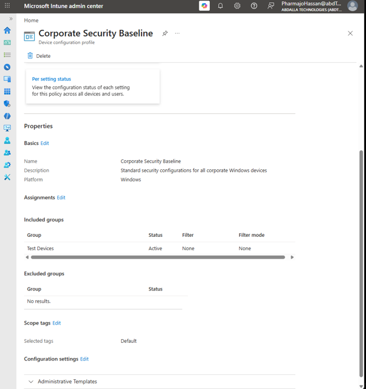

**Figure 4.** Corporate Security Baseline device configuration profile created and assigned to the Test Devices security group.

### Validation

The screenshot confirms that the **Corporate Security Baseline** device configuration profile was successfully created and assigned to the Test Devices security group. This demonstrates how Microsoft Intune can centrally manage and distribute standardised Windows configuration settings using group-based assignments.

---

## 4. Windows Compliance Policy

### Implementation

Following the configuration of the device profile, a Windows compliance policy named **Corporate Windows Compliance Policy** was created in Microsoft Intune. The policy was designed to evaluate Windows devices against the organisation's minimum security requirements before access to corporate resources is granted.

The policy was configured for Windows 10 and later devices and assigned through Microsoft Intune using group-based targeting.

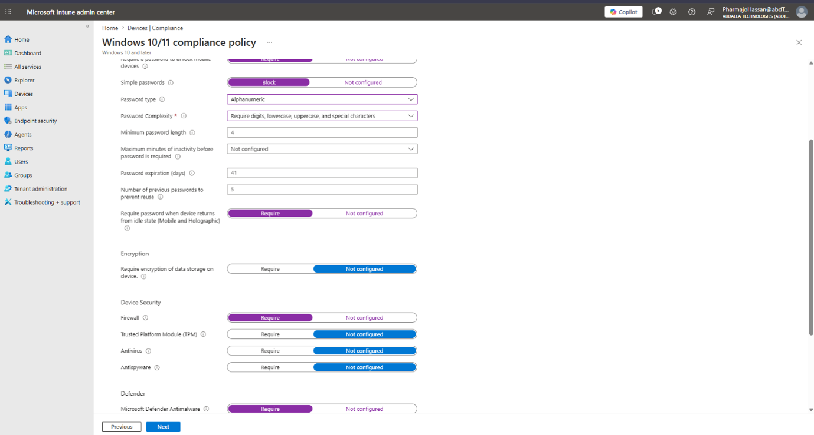

**Figure 5.** Corporate Windows Compliance Policy created for Windows 10 and later devices.

The policy was then configured with the organisation's required compliance settings to ensure managed devices met the defined security baseline.

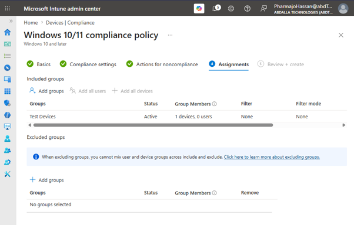

**Figure 6.** Security requirements configured within the compliance policy.

Finally, the policy was assigned to the **Test Devices** security group for deployment.

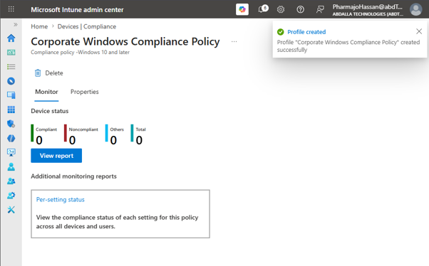

**Figure 7.** Corporate Windows Compliance Policy assigned to the Test Devices security group.

### Validation

The screenshots confirm that the **Corporate Windows Compliance Policy** was successfully created, configured, and assigned within Microsoft Intune. This demonstrates the use of compliance policies to evaluate managed Windows devices against defined organisational security requirements.

---

## 5. Microsoft Defender Endpoint Security

### Implementation

To strengthen the security posture of managed Windows devices, a Microsoft Defender Antivirus endpoint security policy was created in Microsoft Intune. Endpoint security policies provide administrators with a centralised method of configuring Microsoft Defender security settings across managed devices while ensuring consistent protection against malware and other security threats.

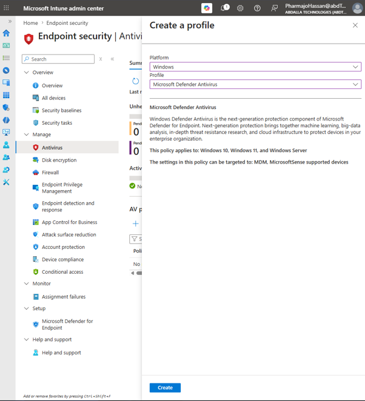

**Figure 8.** Microsoft Defender Antivirus endpoint security policy.

The policy was configured for Windows devices and assigned to the **Test Devices** security group. By using group-based assignments, any device added to the group automatically receives the configured Microsoft Defender Antivirus settings, reducing administrative effort and ensuring consistent security configurations throughout the environment.

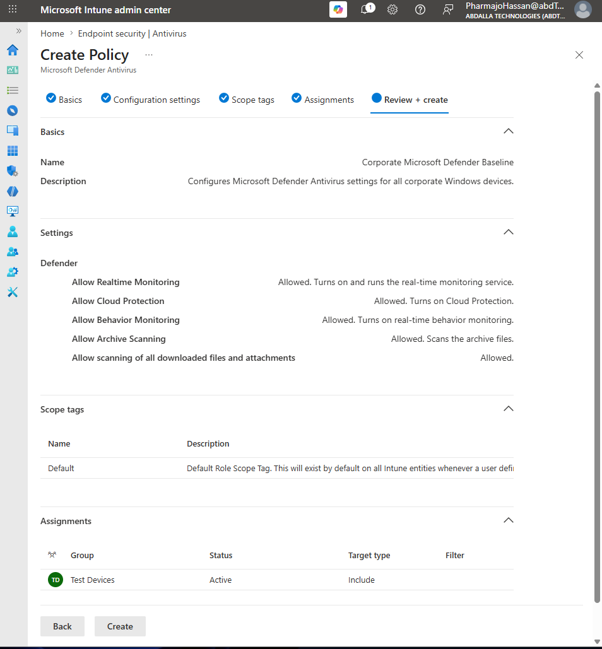

**Figure 9.** Microsoft Defender Antivirus policy configuration and assignment settings.

After configuration was completed, the policy was successfully created and made available for deployment through Microsoft Intune.

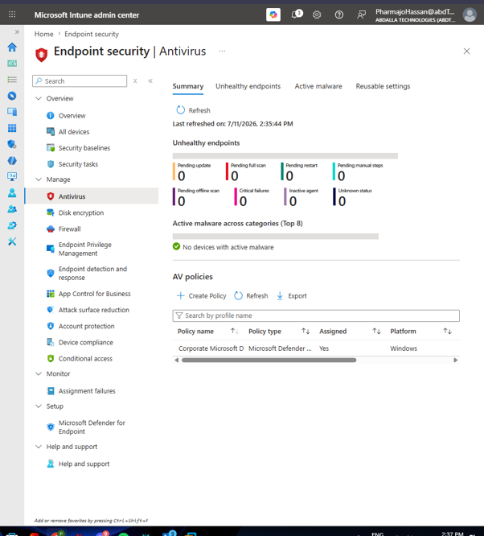

**Figure 10.** Microsoft Defender Antivirus policy successfully created and assigned.

### Validation

The screenshots confirm that the Microsoft Defender Antivirus endpoint security policy was successfully created, configured, and assigned to the Test Devices security group. This demonstrates the implementation of centrally managed endpoint protection through Microsoft Intune, enabling consistent Microsoft Defender security settings to be deployed using group-based assignments.

---

## 6. Win32 Application Deployment

### Implementation

To standardise software deployment across managed devices, a Win32 application package for **Google Chrome** was created and deployed through Microsoft Intune. Win32 applications enable administrators to centrally distribute desktop applications without requiring manual installation on individual devices.

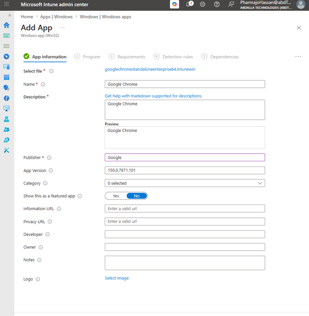

**Figure 11.** Google Chrome Win32 application configured in Microsoft Intune prior to deployment.

The Google Chrome installation package was configured with the required installation and detection rules before being assigned to the **Test Devices** security group. Using group-based deployment ensures that eligible devices automatically receive the application when they are enrolled in Microsoft Intune and become members of the assigned security group.

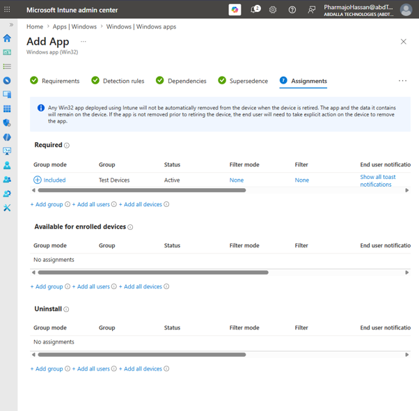

**Figure 12.** Google Chrome Win32 application assigned to the Test Devices security group for deployment.

Following deployment, Microsoft Intune reported a successful installation on the managed Windows device.

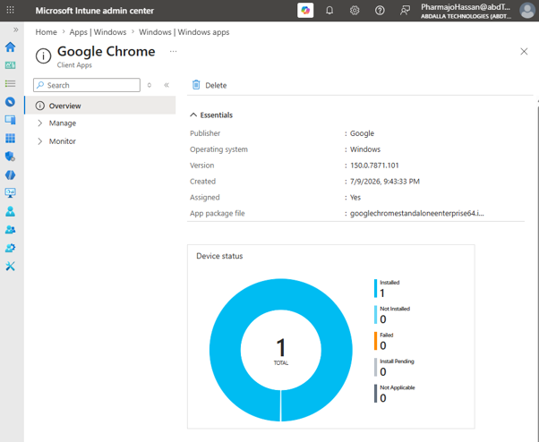

**Figure 13.** Google Chrome successfully deployed to the managed Windows device through Microsoft Intune.

### Validation

The screenshots confirm that the Google Chrome Win32 application was successfully configured, assigned to the Test Devices security group, and deployed through Microsoft Intune. The deployment status indicates that the application was successfully installed on the targeted managed Windows device, demonstrating the use of Microsoft Intune to centrally manage and automate enterprise software deployment.

---

## 7. Conditional Access

### Implementation

To strengthen identity security, a Microsoft Entra Conditional Access policy was configured to require multi-factor authentication (MFA) for users assigned to administrative roles. Conditional Access enables organisations to enforce access controls based on user identity, application, device, and risk conditions, helping to protect privileged accounts from unauthorised access.

The policy targeted administrative users accessing Microsoft cloud applications while excluding designated emergency access accounts to prevent accidental administrative lockout. Grant controls were configured to require multi-factor authentication before access was granted, providing an additional layer of security for privileged identities.

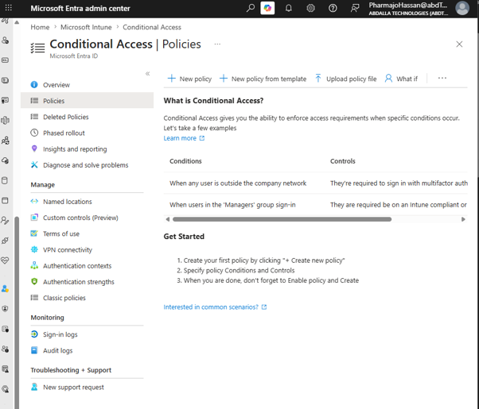

**Figure 14.** Microsoft Entra Conditional Access policy interface used to configure identity-based access controls.

The policy was configured to target users assigned to Microsoft Entra administrative directory roles.

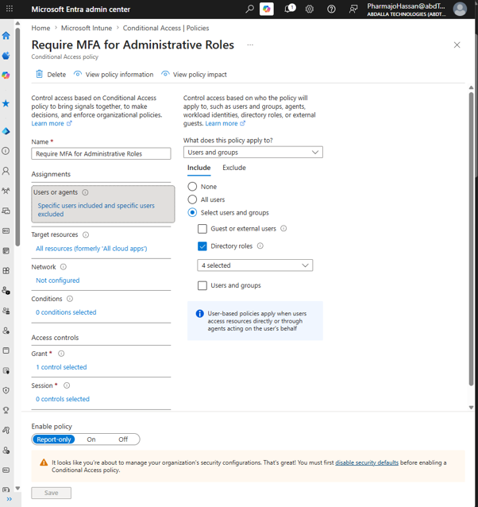

**Figure 15.** Conditional Access policy configured to target users assigned to administrative directory roles.

Grant controls were configured to require multi-factor authentication before administrative users could access Microsoft cloud resources.

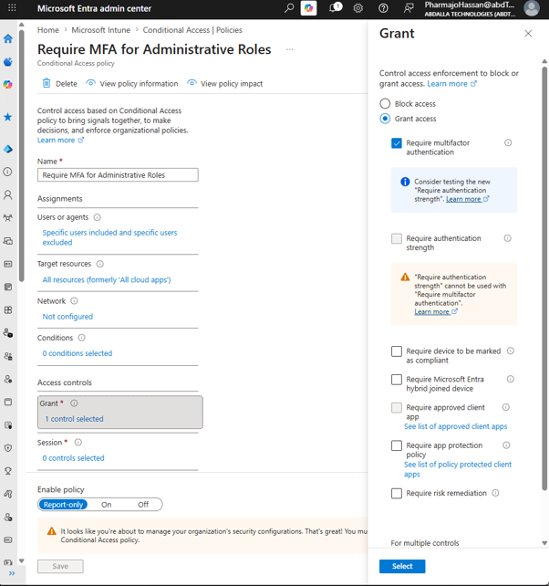

**Figure 16.** Grant controls configured to require multi-factor authentication for administrative access.

After configuration was completed, the policy was ready for deployment within the Microsoft Entra environment.

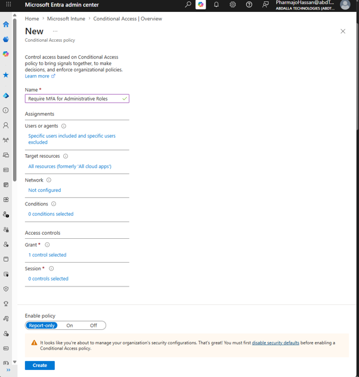

**Figure 17.** Completed "Require MFA for Administrative Roles" Conditional Access policy.

### Validation

The screenshots confirm that a Conditional Access policy named **Require MFA for Administrative Roles** was successfully configured in Microsoft Entra ID. The policy targets users assigned to administrative directory roles and requires multi-factor authentication before access is granted to Microsoft cloud resources. This demonstrates the implementation of identity-based access controls to strengthen the security of privileged accounts through Microsoft Entra Conditional Access.

---

# Outcome

The implementation successfully established a centrally managed Windows endpoint administration environment using Microsoft Intune and Microsoft Entra ID. Managed devices were enrolled into the tenant, organised through Microsoft Entra security groups, and administered using centrally configured configuration profiles, compliance policies, endpoint security policies, and Win32 application deployment.

Identity security was further strengthened through the configuration of a Conditional Access policy requiring multi-factor authentication for privileged administrative roles. Together, these configurations demonstrate how Microsoft Intune and Microsoft Entra ID can be used to manage device configuration, security, application deployment, and identity protection within an enterprise environment.

---

# Key Takeaways

- Implemented Microsoft Intune to centrally manage Windows endpoints.
- Enrolled Windows devices into Microsoft Intune through Microsoft Entra ID.
- Organised managed devices using Microsoft Entra security groups.
- Created and assigned Windows device configuration profiles.
- Configured compliance policies to evaluate device security requirements.
- Implemented Microsoft Defender Antivirus endpoint security policies.
- Deployed Google Chrome as a Win32 application using group-based assignments.
- Configured Microsoft Entra Conditional Access to require multi-factor authentication for administrative roles.
- Applied group-based administration to simplify policy and application deployment.
- Documented each stage of implementation using evidence-based validation.

---

# Skills Demonstrated

## Microsoft Intune

- Windows device enrollment
- Device configuration profiles
- Compliance policy administration
- Endpoint security management
- Win32 application deployment
- Device lifecycle management

## Microsoft Entra ID

- Security group administration
- Device identity management
- Conditional Access
- Multi-factor authentication (MFA)
- Role-based targeting

## Microsoft 365 Administration

- Centralised endpoint management
- Policy-based administration
- Enterprise device security
- Group-based deployments

## Professional Skills

- Technical documentation
- Security implementation
- Enterprise endpoint administration
- Troubleshooting and validation
- Configuration management

---

## Conclusion

This project demonstrates the implementation of enterprise endpoint management using Microsoft Intune and Microsoft Entra ID within a simulated business environment. It showcases practical experience in Windows device enrolment, policy management, endpoint protection, software deployment, and identity security using Microsoft 365 technologies.

The completed implementation highlights the ability to configure and administer enterprise endpoint management solutions while documenting each stage using industry-style technical documentation supported by implementation evidence.
