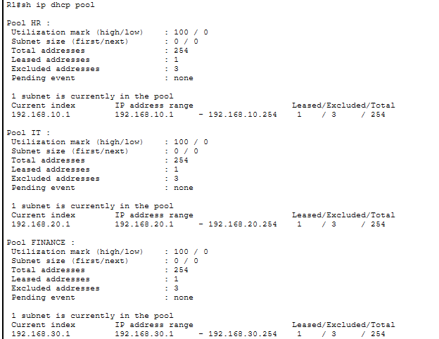
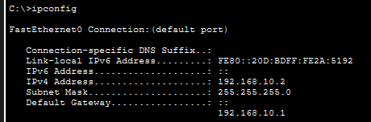
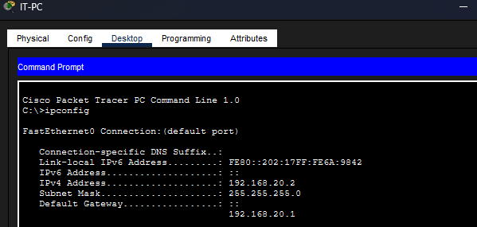
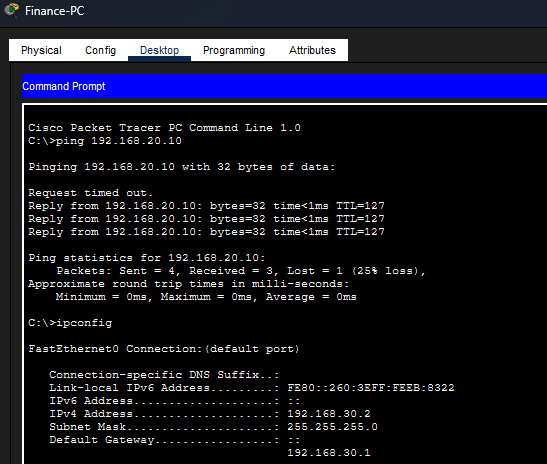
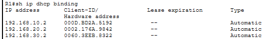

# Enterprise DHCP Deployment

## Summary

Automated address assignment for HR, IT and Finance by configuring a separate Cisco IOS DHCP pool for each departmental VLAN.

| Item | Details |
|---|---|
| Router | Cisco 2911 |
| Switch | Cisco Catalyst 2960 |
| Platform | Cisco Packet Tracer |
| DHCP service | Cisco IOS router |
| Client networks | VLAN 10 HR, VLAN 20 IT and VLAN 30 Finance |

## Business requirement

Manual workstation addressing was slow and created a risk of duplicate or incorrect IP settings. Each department needed automatic configuration from its own subnet while infrastructure addresses remained reserved.

## Implementation

### 1. Create DHCP pools

Configured separate pools with the correct network, default gateway and DNS settings. Gateway and infrastructure addresses were excluded from dynamic allocation.

### 2. Obtain client addresses

Configured each workstation for DHCP and confirmed it received settings from the pool matching its VLAN.

| Client | Evidence |
|---|---|
| HR |  |
| IT |  |
| Finance |  |

### 3. Verify leases

Reviewed the DHCP binding table to confirm that leases were issued to the client devices.

## Topology and validation

| Check | Result |
|---|---|
| Separate pool exists for each VLAN | Pass |
| Infrastructure addresses excluded | Pass |
| Clients receive the correct subnet settings | Pass |
| Leases appear in the binding table | Pass |
| Inter-VLAN connectivity remains operational | Pass |

## Outcome

Clients obtained consistent network settings without manual configuration. The deployment reduced administrative effort and integrated successfully with the existing VLAN and routing design.

## Skills demonstrated

Cisco IOS DHCP · DHCP pools · Address exclusions · Lease verification · VLAN-based addressing · IP configuration · Network testing

[Back to Networking projects](../)
