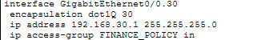
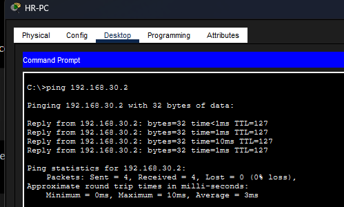
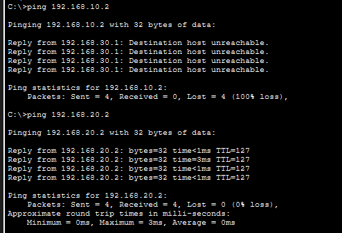
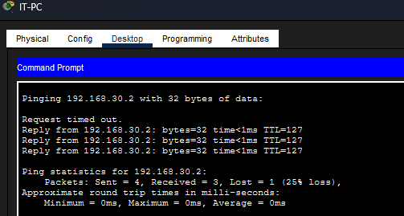

# Case Study 08 - Directional Traffic Control Using Extended Access Control Lists (ACLs)

## Overview

This project demonstrates the implementation of Cisco Extended Access Control Lists (ACLs) to enforce directional communication policies between departmental VLANs. Rather than completely isolating departments, the ACL was designed to allow Human Resources (HR) to initiate communication with the Finance department while preventing Finance from initiating communication back to HR. The IT department retained unrestricted access for administrative purposes.

---

## Business Scenario

The organisation required a security policy that allowed HR staff to verify connectivity to Finance resources while preventing the Finance department from initiating communication towards HR devices. This ensured that HR users could perform connectivity testing without allowing unsolicited traffic originating from the Finance network.

---

## Objectives

- Control the direction of communication between HR and Finance.
- Permit HR to initiate ICMP communication with Finance.
- Prevent Finance from initiating communication with HR.
- Maintain unrestricted communication for the IT department.
- Validate the implemented security policy.

---

## Environment

| Component | Configuration |
|-----------|---------------|
| Router | Cisco 2911 |
| Switch | Cisco Catalyst 2960 |
| Routing Method | Router-on-a-Stick |
| Security Technology | Cisco Extended ACL |
| VLAN 10 | HR |
| VLAN 20 | IT |
| VLAN 30 | Finance |

---

## Network Topology

The ACL was implemented within an enterprise network consisting of three departmental VLANs connected through Router-on-a-Stick routing.

---

## Implementation

### Extended ACL Configuration

An Extended ACL named **FINANCE_POLICY** was created and applied inbound on the Finance router subinterface. The policy explicitly permitted ICMP echo replies from Finance to HR while denying all other traffic initiated from the Finance VLAN towards the HR VLAN. Remaining traffic destined for other networks was permitted.

**Evidence**

**Figure 1 – Extended ACL Configuration**

---

### ACL Deployment

The ACL was applied inbound on the Finance router subinterface to inspect traffic originating from the Finance network before it entered the routed network.

**Evidence**

**Figure 2 – ACL Applied to Router Interface**

---

## Validation

Testing confirmed that the directional security policy functioned as intended.

### Figure 3 – HR Successfully Initiates Communication with Finance

---

### Figure 4 – Finance Cannot Initiate Communication with HR

---

### Figure 5 – IT Administrative Access Maintained

---

## Outcome

The implementation successfully enforced directional communication between departmental VLANs. HR users were able to initiate connectivity tests towards Finance, while Finance was prevented from initiating unsolicited communication towards HR. The IT department retained unrestricted access, ensuring administrative operations were unaffected.

---

## Skills Demonstrated

- Cisco Extended ACLs
- Directional Traffic Filtering
- ICMP Traffic Control
- Enterprise Network Security
- Router-on-a-Stick
- Cisco IOS Verification Commands
- Network Validation
- Principle of Least Privilege

---

## Lessons Learned

- Extended ACLs evaluate traffic using source address, destination address, protocol and traffic direction.
- ACL entries are processed sequentially from top to bottom, with the first matching rule determining the outcome.
- Explicitly permitting ICMP echo replies enables one-way ping communication while maintaining directional restrictions.
- Applying Extended ACLs close to the source reduces unnecessary traffic across the network.
