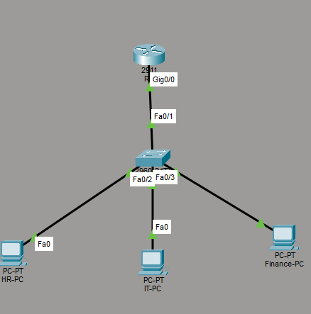

# Directional Traffic Control with Extended ACLs

## Summary

Applied a Cisco extended ACL that allowed HR to initiate ICMP communication with Finance while preventing Finance from initiating traffic toward HR. IT retained administrative access.

| Item | Details |
|---|---|
| Router | Cisco 2911 |
| Switch | Cisco Catalyst 2960 |
| Routing | Router-on-a-stick |
| Policy | `FINANCE_POLICY` |
| Target interface | Finance subinterface, inbound |
| Platform | Cisco Packet Tracer |

## Business requirement

HR needed to test reachability to Finance resources, but Finance devices were not permitted to initiate unsolicited traffic toward HR. IT required unrestricted connectivity for support.

## Policy implementation

Created `FINANCE_POLICY` to:

1. Permit ICMP echo replies from Finance to HR.
2. Deny other Finance-initiated traffic destined for HR.
3. Permit remaining traffic to other networks.

Applying the ACL inbound on the Finance subinterface filters traffic close to its source.

## Topology and validation

| Test | Expected | Result |
|---|---|---|
| HR initiates ping to Finance | Allowed | Pass |
| Finance initiates ping to HR | Blocked | Pass |
| IT reaches Finance | Allowed | Pass |

## Outcome

The ACL enforced the directional requirement without unnecessarily isolating either department. Explicitly permitting echo replies allowed HR-initiated ping tests to complete while blocking new Finance-initiated communication.

## Skills demonstrated

Cisco extended ACLs · Rule order · ICMP control · Inbound filtering · Router-on-a-stick · Least privilege · Policy testing

[Back to Networking projects](../)
