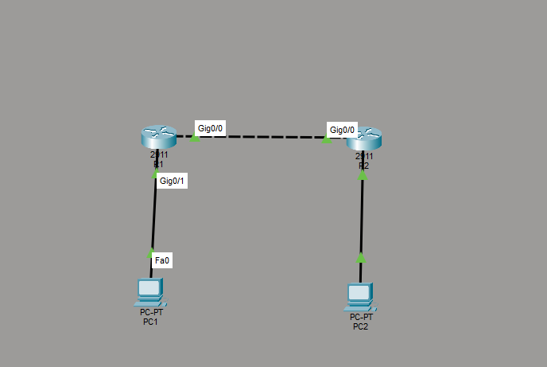
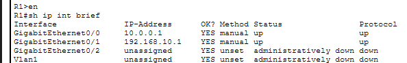
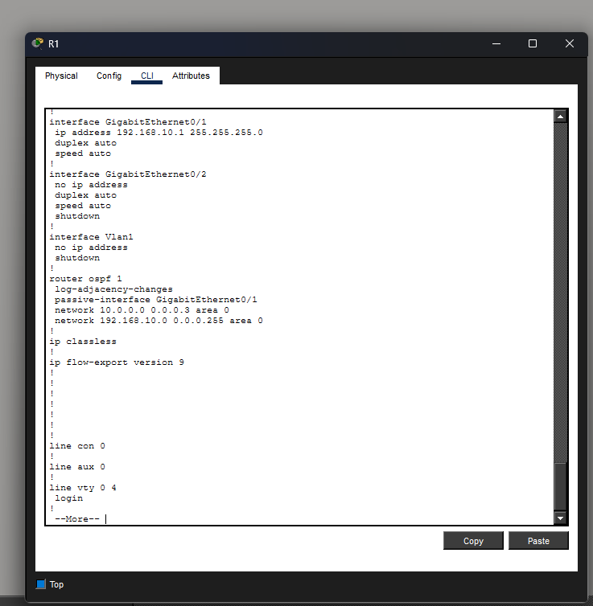
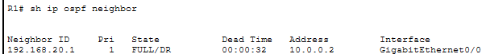
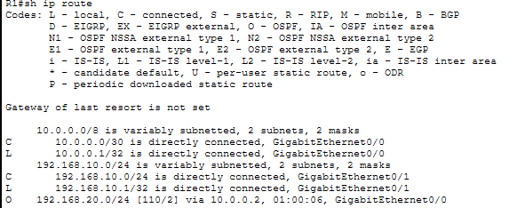
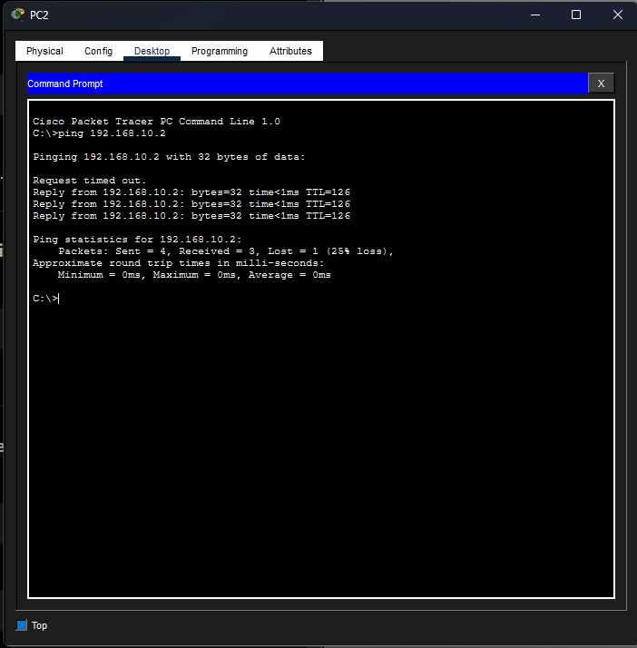

# Case Study -Dynamic Routing Using OSPF

## Overview

This project demonstrates the implementation of Open Shortest Path First (OSPF) to provide dynamic routing between multiple networks in an enterprise environment. Unlike static routing, OSPF automatically exchanges routing information between routers, enabling networks to be discovered dynamically and reducing administrative overhead as the network grows.

---

## Business Scenario

A growing organisation has expanded to include multiple office locations connected by routers. Maintaining static routes for every network has become increasingly difficult and prone to configuration errors.

To improve scalability and simplify network administration, OSPF was implemented to dynamically advertise connected networks and automatically populate routing tables between routers.

---

## Objectives

- Configure OSPF on Cisco routers.
- Advertise directly connected networks.
- Establish OSPF neighbour relationships.
- Verify dynamically learned routes.
- Validate end-to-end communication between remote networks.
- Implement passive interfaces following enterprise best practices.

---

## Environment

| Component | Configuration |
|-----------|---------------|
| Router | Cisco 2911 |
| Routing Protocol | OSPFv2 |
| Area | Area 0 |
| LAN 1 | 192.168.10.0/24 |
| LAN 2 | 192.168.20.0/24 |
| Router Link | 10.0.0.0/30 |
| Simulation Platform | Cisco Packet Tracer |

---

## Network Topology

Two routers were connected through a point-to-point link, with each router providing gateway services for a separate LAN. OSPF was configured to dynamically exchange routing information between the routers.

---

## Implementation

### Interface Configuration

Each router interface was configured with the appropriate IP address before enabling dynamic routing.

**Evidence**

**Figure 1 – Router Interface Configuration**

---

### OSPF Configuration

OSPF Process 1 was configured on both routers. Network statements were used to enable OSPF on the router-to-router link while advertising each router's connected LAN.

To follow enterprise best practices, LAN interfaces were configured as passive interfaces to prevent unnecessary OSPF neighbour discovery on user networks while continuing to advertise those networks.

**Evidence**

**Figure 2 – OSPF Configuration**

---

### OSPF Neighbour Establishment

After configuration, both routers successfully formed an OSPF neighbour relationship across the point-to-point link.

**Evidence**

**Figure 3 – OSPF Neighbour Relationship**

---

### Dynamic Route Learning

Once adjacency was established, each router automatically learned the remote LAN through OSPF without requiring static routes.

**Evidence**

**Figure 4 – OSPF Routing Table**

---

## Validation

Connectivity testing confirmed that devices on separate LANs successfully communicated using dynamically learned OSPF routes.

**Evidence**

**Figure 5 – Successful End-to-End Connectivity**

---

## Outcome

The implementation successfully replaced the need for static routing by introducing OSPF dynamic routing. Routers automatically exchanged routing information, built neighbour relationships and learned remote networks, providing a scalable routing solution suitable for enterprise environments.

---

## Skills Demonstrated

- Cisco OSPF Configuration
- Dynamic Routing
- OSPF Neighbour Relationships
- Route Advertisement
- Passive Interface Configuration
- Enterprise Routing
- Cisco IOS Verification Commands
- Network Validation

---

## Lessons Learned

- OSPF dynamically exchanges routing information between neighbouring routers.
- OSPF neighbour relationships are formed only on interfaces participating in the protocol.
- Passive interfaces allow connected networks to be advertised without sending OSPF Hello packets.
- Dynamic routing significantly reduces administrative overhead compared to static routing.
- Verification commands are essential for confirming neighbour relationships and learned routes.
