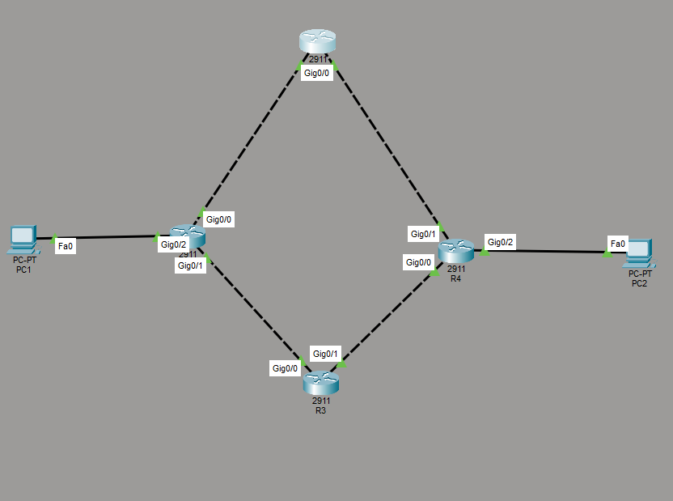
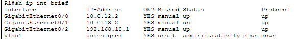
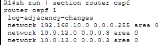
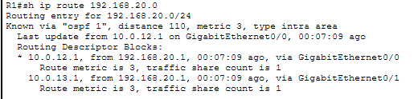
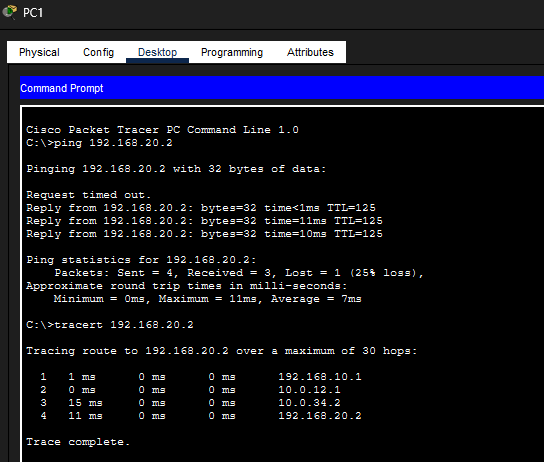
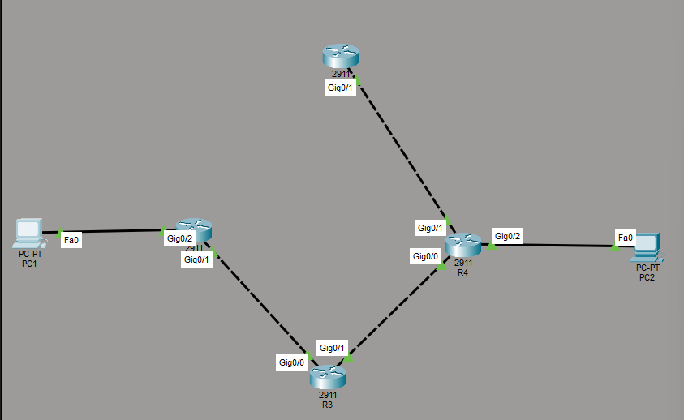
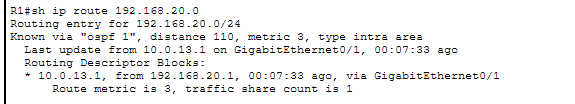

# OSPF Redundancy and ECMP Failover

## Summary

Built two equal-cost OSPF paths between remote LANs, verified both routes in the routing table, failed one path and confirmed that traffic continued through the surviving route without manual intervention.

| Item | Details |
|---|---|
| Routers | R1, R2, R3 and R4 |
| Routing | OSPFv2 Area 0 |
| Transit links | `/30` point-to-point networks |
| Redundancy | Equal-Cost Multi-Path routing |
| Platform | Cisco Packet Tracer |

## Business requirement

A single routed path created a point of failure between two LANs. The network needed automatic route learning, multiple usable paths and continued connectivity when one transit router or link became unavailable.

## Design

R1 reaches R4 through either R2 or R3. Both paths were designed with equal OSPF cost.

| Segment | Network |
|---|---|
| R1–R2 | `10.0.12.0/30` |
| R1–R3 | `10.0.13.0/30` |
| R2–R4 | `10.0.24.0/30` |
| R3–R4 | `10.0.34.0/30` |
| R4 LAN | `192.168.10.0/24` |
| Remote LAN | `192.168.20.0/24` |

## Implementation

### 1. Configure interfaces and addressing

Assigned the transit and LAN addresses, enabled each interface and verified its status.

### 2. Configure OSPF

Advertised the transit and LAN networks into Area 0 on all four routers.

### 3. Verify adjacencies and ECMP

Confirmed OSPF neighbour formation and checked the routing table for two equal-cost next hops to the remote LAN.

## Failure testing

### Baseline

End-to-end connectivity succeeded before the failure.

### Introduced failure

Disabled the R2 path to simulate a transit failure.

### Recovery verification

OSPF removed the failed next hop and retained the route through R3. End-to-end traffic continued without adding or changing a route manually.

| Test | Result |
|---|---|
| OSPF neighbours established | Pass |
| Two equal-cost routes installed initially | Pass |
| Connectivity available before failure | Pass |
| Failed route withdrawn | Pass |
| Remaining route preserved | Pass |
| Connectivity continued through R3 | Pass |

## Outcome

The topology eliminated dependence on a single transit path. OSPF and ECMP provided automatic route selection, and the controlled failure proved that the network could recover using the remaining path.

## Skills demonstrated

OSPF · ECMP · `/30` design · Neighbour verification · Routing-table analysis · Redundancy · Failure simulation · Failover validation · Ping and traceroute

[Back to OSPF project](../) · [Back to Networking projects](../../)
