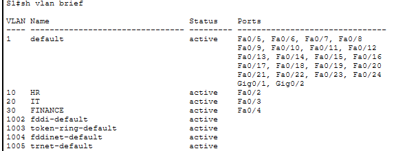
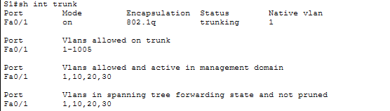
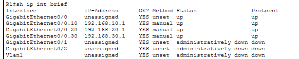
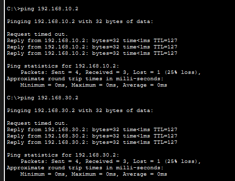

# Case Study 06 - Enterprise VLAN Segmentation and Inter-VLAN Routing

## Overview

This project demonstrates the implementation of a segmented enterprise network using Virtual Local Area Networks (VLANs) and Router-on-a-Stick inter-VLAN routing. The network was designed to logically separate departmental traffic while allowing controlled communication between departments through a Layer 3 router.

---

## Business Scenario

A growing organisation required its Human Resources (HR), Information Technology (IT) and Finance departments to be logically separated to improve network organisation, security and broadcast efficiency. Although each department required its own isolated network, authorised communication between departments was still necessary for normal business operations.

To meet these requirements, VLAN segmentation was implemented on the access switch, with inter-VLAN routing provided by a Cisco router using IEEE 802.1Q trunking.

---

## Objectives

- Create separate VLANs for HR, IT and Finance.
- Assign switch access ports to the correct departmental VLANs.
- Configure an IEEE 802.1Q trunk between the switch and router.
- Implement Router-on-a-Stick inter-VLAN routing.
- Verify successful communication between departmental VLANs.

---

## Environment

| Component | Configuration |
|-----------|---------------|
| Router | Cisco 2911 |
| Switch | Cisco Catalyst 2960 |
| Routing Method | Router-on-a-Stick |
| VLAN 10 | HR |
| VLAN 20 | IT |
| VLAN 30 | Finance |
| Simulation Platform | Cisco Packet Tracer |

---

## Network Topology

The network consisted of three departmental workstations connected to a Layer 2 switch. A single trunk link connected the switch to the router, where individual subinterfaces provided Layer 3 routing between VLANs.

---

## Implementation

### VLAN Configuration

Three VLANs were created to provide logical separation between departments. Access ports were assigned according to their departmental function.

**Evidence**

**Figure 1 – VLAN Configuration**

---

### Trunk Configuration

The uplink between the switch and router was configured as an IEEE 802.1Q trunk, allowing traffic from multiple VLANs to traverse a single physical connection.

**Evidence**

**Figure 2 – Trunk Verification**

---

### Router-on-a-Stick Configuration

Router subinterfaces were configured with unique IP addresses for each VLAN, providing the default gateway for every department and enabling inter-VLAN routing.

**Evidence**

**Figure 3 – Router Subinterfaces**

---

## Validation

Connectivity testing confirmed successful communication between devices located in different VLANs. This verified that VLAN segmentation, trunking and Router-on-a-Stick routing were operating correctly.

**Evidence**

**Figure 4 – Successful Inter-VLAN Connectivity**

---

## Outcome

The network was successfully segmented into three departmental VLANs while maintaining controlled communication between departments through Router-on-a-Stick routing. The implementation improved logical separation, reduced broadcast domains and established a scalable foundation for additional enterprise networking services such as DHCP and Access Control Lists.

---

## Skills Demonstrated

- Cisco VLAN Configuration
- IEEE 802.1Q Trunking
- Router-on-a-Stick
- Inter-VLAN Routing
- Network Segmentation
- Layer 2 Switching
- Layer 3 Routing
- Enterprise Network Validation

---

## Lessons Learned

- VLANs provide logical separation without requiring additional physical infrastructure.
- IEEE 802.1Q trunking enables multiple VLANs to share a single physical link.
- Router-on-a-Stick allows inter-VLAN communication using router subinterfaces.
- Verifying VLANs, trunk links and routing together provides confidence that the entire network is functioning correctly.
