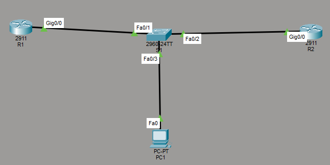
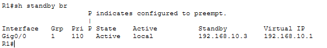
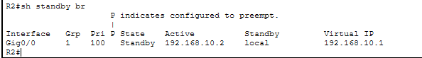
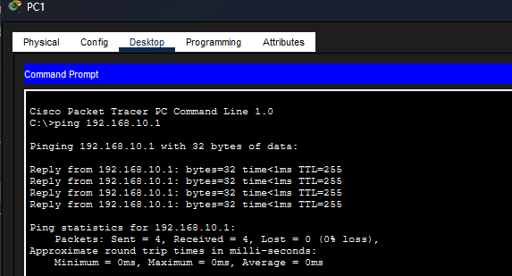
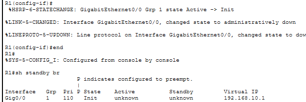
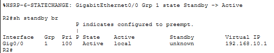
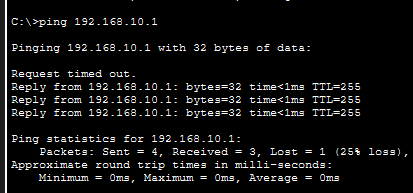
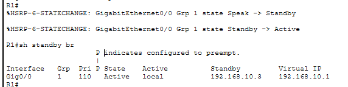

# HSRP Default Gateway Redundancy

## Overview

This project demonstrates the implementation of **HSRP (Hot Standby Router Protocol)** to provide default gateway redundancy in a LAN environment using Cisco Packet Tracer.

Two routers were configured to share a virtual default gateway. R1 was configured as the preferred Active router, while R2 operated as the Standby router.

A failure was then introduced on R1 to verify that R2 could automatically assume the Active role and maintain access to the virtual gateway. R1 was subsequently restored to verify automatic failback using HSRP preemption.

---

## Business Scenario

A LAN currently relies on a single router as its default gateway.

This creates a **single point of failure**. If the gateway router or its LAN-facing interface becomes unavailable, connected devices lose access to their default gateway even if another router is available.

To improve network availability, two routers were configured using HSRP.

Instead of configuring end devices with the physical IP address of either router, hosts use a shared virtual IP address as their default gateway.

This allows another router to assume responsibility for the gateway if the primary router becomes unavailable.

---

## Objectives

- Configure two routers on the same LAN
- Implement HSRP gateway redundancy
- Configure a shared virtual default gateway
- Configure R1 as the preferred Active router
- Configure R2 as the Standby router
- Verify normal HSRP operation
- Simulate failure of the Active router
- Verify automatic HSRP failover
- Confirm connectivity is maintained after failure
- Restore the preferred router
- Verify automatic failback using preemption

---

## Environment

| Component | Details |
|---|---|
| Platform | Cisco Packet Tracer |
| Routers | 2 × Cisco 2911 |
| Switch | Cisco 2960 |
| End Device | 1 × PC |
| Redundancy Protocol | HSRP |
| HSRP Group | 1 |
| LAN | 192.168.10.0/24 |
| Virtual Gateway | 192.168.10.1 |

---

## Network Topology

Both routers connect to the same Layer 2 switch, along with the client device.



The addressing design was:

| Device | IP Address | HSRP Role |
|---|---|---|
| Virtual Gateway | 192.168.10.1 | Shared Gateway |
| R1 | 192.168.10.2 | Preferred Active |
| R2 | 192.168.10.3 | Standby |
| PC1 | 192.168.10.x | Client |

PC1 was configured to use:

```text
Default Gateway: 192.168.10.1
```

The client therefore does not depend directly on either router's physical IP address.

---

# Implementation

## 1. HSRP Virtual Gateway

Both routers were configured as members of **HSRP Group 1** using the same virtual IP address:

```bash
standby 1 ip 192.168.10.1
```

This virtual address was configured as the default gateway for the client.

R1 and R2 maintain their own physical addresses:

```text
R1: 192.168.10.2
R2: 192.168.10.3
```

while presenting:

```text
192.168.10.1
```

as the shared gateway to hosts on the LAN.

---

## 2. Active and Standby Router Selection

R1 was configured with a higher HSRP priority:

```bash
standby 1 priority 110
```

R2 remained at priority:

```text
100
```

Because the higher HSRP priority is preferred, R1 became the Active router.

R1 was also configured with:

```bash
standby 1 preempt
```

Preemption allows R1 to reclaim the Active role after recovering from a failure because it has the higher priority.

---

## 3. Initial HSRP State

HSRP status was verified using:

```bash
show standby brief
```

### R1



R1 showed:

```text
Priority: 110
State: Active
Active: local
Standby: 192.168.10.3
Virtual IP: 192.168.10.1
```

### R2



R2 showed:

```text
Priority: 100
State: Standby
Active: 192.168.10.2
Standby: local
Virtual IP: 192.168.10.1
```

This confirmed that the initial HSRP election operated as intended:

```text
R1 → Active
R2 → Standby
```

---

# Validation

## 1. Normal Gateway Connectivity

Before introducing a failure, PC1 tested connectivity to the virtual gateway:

```bash
ping 192.168.10.1
```



The virtual gateway responded successfully with:

```text
Packets: Sent = 4, Received = 4, Lost = 0
```

This confirmed that the HSRP virtual gateway was operational.

At this stage, R1 was the Active router and was responsible for the virtual gateway.

---

## 2. Active Router Failure

To simulate a gateway failure, R1's LAN-facing interface was administratively shut down.

R1 transitioned out of the Active HSRP state.



The HSRP output showed R1 entering the `Init` state after the interface became unavailable.

This removed R1 from active participation in the HSRP group.

---

## 3. Automatic HSRP Failover

After R1 became unavailable, R2 detected the loss of the Active router and transitioned:

```text
Standby → Active
```



R2 now showed:

```text
Priority: 100
State: Active
Active: local
Virtual IP: 192.168.10.1
```

R2 therefore assumed responsibility for the same virtual gateway previously handled by R1.

No change was required on PC1.

Its default gateway remained:

```text
192.168.10.1
```

---

## 4. Connectivity After Failure

After R2 assumed the Active role, connectivity to the virtual gateway was tested again from PC1.

```bash
ping 192.168.10.1
```



The first ping timed out during the HSRP transition, after which communication resumed successfully.

```text
Packets: Sent = 4, Received = 3, Lost = 1
```

This demonstrated that there was a brief interruption during failover, but connectivity to the virtual gateway was automatically restored through R2.

Most importantly, no gateway configuration change was required on the client.

---

## 5. Recovery and Preemption

R1's interface was then restored.

Because R1 had:

```text
Priority: 110
```

and was configured with:

```bash
standby 1 preempt
```

it was able to reclaim the Active role from R2.

During recovery, R1 progressed through HSRP states before returning to Active:

```text
Listen → Speak → Standby → Active
```



The final HSRP state returned to:

```text
R1 → Active
R2 → Standby
```

This confirmed that preemption was functioning correctly and that the preferred router could automatically regain control after recovering.

---

## Outcome

HSRP was successfully implemented to remove the single-router dependency for the LAN's default gateway.

During normal operation:

```text
R1 → Active
R2 → Standby
```

Both routers participated in HSRP Group 1 and shared the virtual gateway:

```text
192.168.10.1
```

When R1 was deliberately taken offline, R2 automatically transitioned from Standby to Active and assumed responsibility for the virtual gateway.

PC1 experienced only a brief interruption during the transition and continued using the same default gateway without any configuration changes.

When R1 was restored, its higher priority and configured preemption allowed it to automatically reclaim the Active role.

The test successfully demonstrated both **gateway failover and automatic failback**.

---

## Skills Demonstrated

- Cisco IOS configuration
- First-Hop Redundancy Protocols
- HSRP configuration
- HSRP Active and Standby roles
- Virtual default gateways
- HSRP priority configuration
- HSRP preemption
- HSRP state interpretation
- Network redundancy
- Gateway failover testing
- Failback testing
- Network availability concepts
- Cisco Packet Tracer

---

## Lessons Learned

This project demonstrated how HSRP can eliminate a single physical router as the sole default gateway for a LAN.

The client does not need to know which physical router is currently forwarding traffic. Instead, it uses the HSRP virtual IP address while the routers determine which device is responsible for the gateway.

The failure test demonstrated that the Standby router can automatically become Active when the preferred router becomes unavailable.

The recovery test also highlighted the purpose of HSRP preemption. A higher priority alone does not automatically cause a recovered router to reclaim the Active role. Preemption allows the preferred router to take the Active role again after it returns.

Observing the HSRP state transitions during failure and recovery also provided practical insight into how gateway redundancy operates rather than only configuring the protocol and assuming failover would occur.
