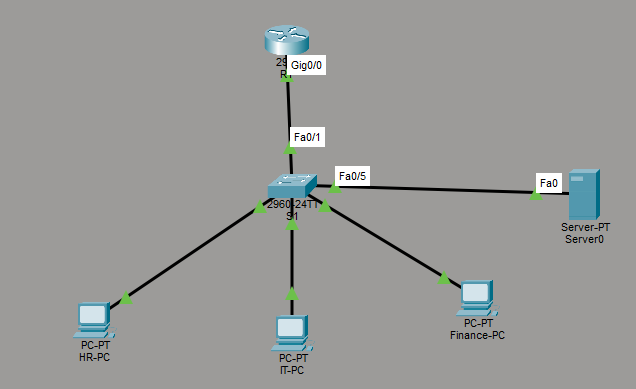
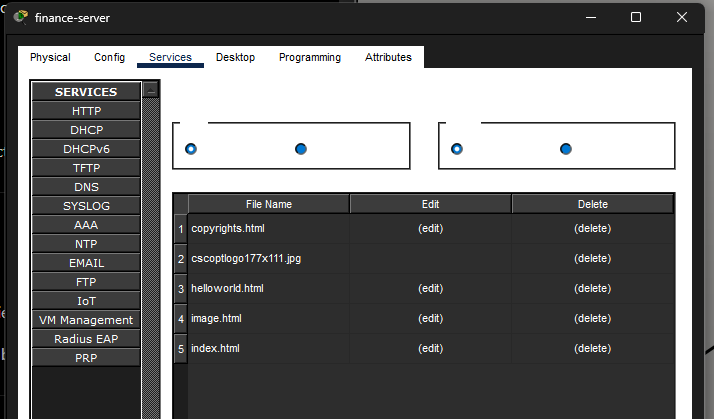
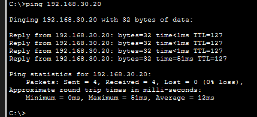
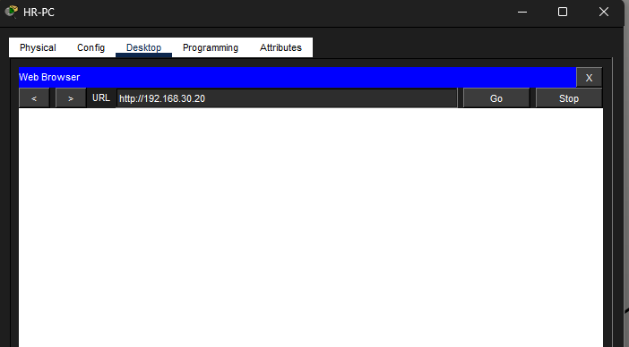
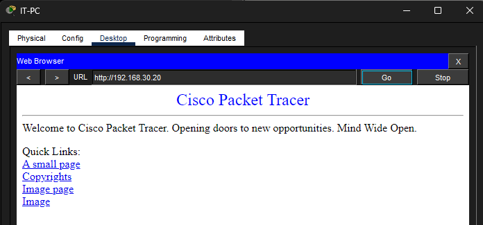

# Case Study 09 - Securing Internal Web Services Using Extended Access Control Lists (ACLs)

## Overview

This project demonstrates the implementation of Cisco Extended Access Control Lists (ACLs) to enforce application-level security within an enterprise network. Rather than restricting communication between entire departments, the ACL was configured to allow basic network connectivity while preventing unauthorised access to a sensitive internal web application.

---

## Business Scenario

The Finance department hosts an internal payroll web application that should only be accessible by authorised personnel. Human Resources (HR) users require basic connectivity to verify server availability but should not be able to browse the web application. The IT department must retain unrestricted access for administration and support.

To meet these requirements, an Extended ACL was implemented to selectively filter HTTP traffic while allowing ICMP connectivity.

---

## Objectives

- Deploy an internal Finance web server.
- Configure Extended ACLs to filter application traffic.
- Allow HR to verify server connectivity using ICMP.
- Prevent HR from accessing the Finance web application.
- Maintain unrestricted access for the IT department.
- Validate that the security policy functions correctly.

---

## Environment

| Component | Configuration |
|-----------|---------------|
| Router | Cisco 2911 |
| Switch | Cisco Catalyst 2960 |
| Routing Method | Router-on-a-Stick |
| Security Technology | Cisco Extended ACL |
| Application | HTTP Web Server |
| VLAN 10 | HR |
| VLAN 20 | IT |
| VLAN 30 | Finance |

---

## Network Topology

The Finance web server was deployed within the existing enterprise network. Extended ACLs were used to selectively control access to the hosted web application.

---

## Implementation

### Finance Web Server Deployment

A dedicated server was configured within the Finance VLAN using a static IP address to provide a consistent endpoint for the payroll application. The HTTP service was enabled to simulate an internal business application.

**Evidence**

**Figure 1 – Finance Server Configuration**

**Figure 2 – HTTP Service Enabled**

---

### Extended ACL Configuration

An Extended ACL named **HR_WEB_POLICY** was created to permit ICMP traffic while denying HTTP traffic originating from the HR VLAN to the Finance web server. The ACL was then applied inbound on the HR router subinterface.

**Evidence**

**Figure 3 – Extended ACL Configuration**

**Figure 4 – ACL Applied to Router Interface**

---

## Validation

Testing confirmed that the application-level security policy operated as intended.

### Figure 5 – HR Successfully Pings the Finance Server

---

### Figure 6 – HR HTTP Access Blocked

---

### Figure 7 – IT Successfully Accesses the Finance Web Server

---

## Outcome

The Extended ACL successfully enforced application-level security by permitting network connectivity while restricting unauthorised access to the Finance web application. The implementation demonstrated how Cisco ACLs can selectively control individual services without disrupting legitimate network communication.

---

## Skills Demonstrated

- Cisco Extended ACLs
- Application-Level Traffic Filtering
- HTTP Security
- Enterprise Network Security
- Router-on-a-Stick
- Cisco IOS Verification Commands
- Network Validation
- Principle of Least Privilege

---

## Lessons Learned

- Extended ACLs can filter traffic using source address, destination address, protocol and destination port.
- Application-level filtering provides more granular security than network-wide restrictions.
- ACL entries are processed sequentially from top to bottom, with the first matching rule determining the outcome.
- Extended ACLs are best applied close to the source of unwanted traffic.
