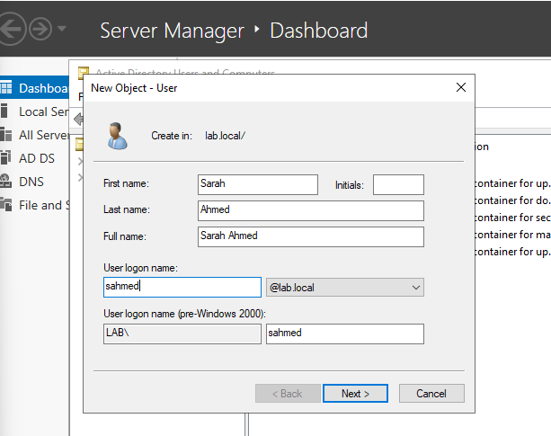
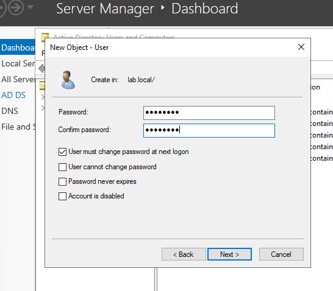
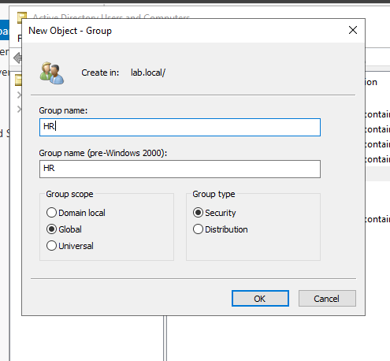
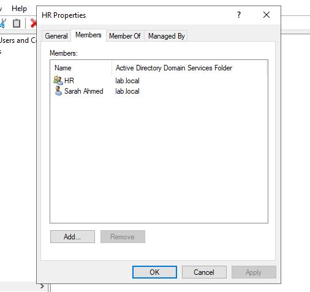
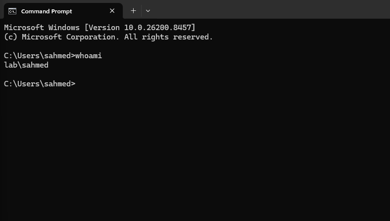

# Case Study 01 – Active Directory User Provisioning & Role-Based Access Control

**Category:** Windows Server Administration

**Technology Stack:** Windows Server 2022 | Active Directory Domain Services | Windows 11 | VMware Workstation

**Author:** Abdalla Hussein

**Status:** Completed

**Last Updated:** July 2026

---

## Overview

This case study demonstrates the implementation of an enterprise-style Active Directory user provisioning process within a Windows Server 2022 environment. The objective was to simulate the onboarding of a new employee by creating and managing user accounts, assigning security group memberships, and validating Role-Based Access Control (RBAC).

The environment was built using Windows Server 2022 and a Windows 11 client hosted in VMware. After provisioning the user account, access permissions were verified to ensure the correct authorization model was applied.

This project demonstrates fundamental systems administration skills commonly performed by IT Support Engineers and Systems Administrators in enterprise environments.

---

## Business Scenario

A new employee has joined the Human Resources department and requires access to the organisation's IT systems.

As the Systems Administrator, the responsibility is to provision the user's account, assign the appropriate security group memberships, and ensure access permissions align with the employee's job role.

Following the principle of Role-Based Access Control (RBAC), permissions are granted through security groups rather than assigned directly to individual user accounts. This approach improves security, simplifies administration, and ensures consistent access management across the organisation.

---

## Environment

| Component | Configuration |
|-----------|---------------|
| Hypervisor | VMware Workstation |
| Domain Controller | Windows Server 2022 |
| Client Device | Windows 11 |
| Domain | lab.local |
| Organisational Unit | HR |
| Security Group | HR_Users |

---

## Implementation Summary

### User Account Created

A new Active Directory user account was created for the Human Resources department using the organisation's standard naming convention.

- **Name:** Sarah Ahmed
- **Username:** sahmed

**Figure 1.** User account created for Sarah Ahmed.

The account was configured to:

- Require a password at first logon.
- Enable the account for immediate use.

**Figure 2.** Password configuration for Sarah Ahmed.

---

### Security Group Created

A Global Security Group named **HR** was created to represent employees within the Human Resources department.

Security groups provide a centralised method of managing permissions by assigning access to groups rather than individual user accounts. This simplifies administration and supports the principle of Role-Based Access Control (RBAC).

**Figure 3.** HR security group created in Active Directory Users and Computers.

---

### Group Membership Assignment

The user account was added to the **HR** security group to inherit department-specific permissions through Role-Based Access Control (RBAC).

By assigning permissions to the security group instead of directly to the user account, access management becomes more scalable, consistent, and easier to maintain as the organisation grows.

**Figure 4.** User account assigned to the HR security group.

---

## Validation

The completed configuration was verified to ensure the user account and security group were correctly configured within Active Directory.

| Validation Check | Result |
|------------------|--------|
| User account successfully created | ✅ Passed |
| HR security group created | ✅ Passed |
| User assigned to HR security group | ✅ Passed |
| Group membership verified in Active Directory | ✅ Passed |

**Figure 5.** Validation performed from the provisioned user account.

---

## Outcome

The Active Directory user provisioning process was successfully completed. A new user account was created, a departmental security group was configured, and the user was assigned the appropriate group membership to implement Role-Based Access Control (RBAC).

The completed configuration was validated to confirm that the identity and access management requirements for the Human Resources department were successfully met.

---

## Key Takeaways

- Active Directory security groups provide a scalable method of managing user permissions through Role-Based Access Control (RBAC).
- Assigning permissions to security groups instead of individual user accounts simplifies administration and improves consistency.
- Standardised user provisioning processes help maintain an organised and secure Active Directory environment.
- Validating completed configurations is an essential step to ensure identity and access management requirements have been met.

---

## Skills Demonstrated

### Identity & Access Management

- Active Directory user provisioning
- Security group administration
- Role-Based Access Control (RBAC)
- User account lifecycle management

### Windows Server Administration

- Active Directory Domain Services (AD DS)
- User and group management
- Administrative validation and verification

### Enterprise Administration Practices

- Identity management
- Principle of least privilege
- Standardised user provisioning
- Technical documentation
- Configuration validation
