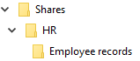
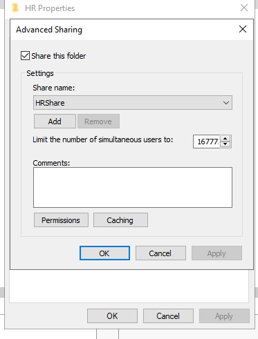
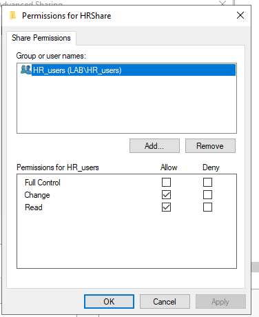
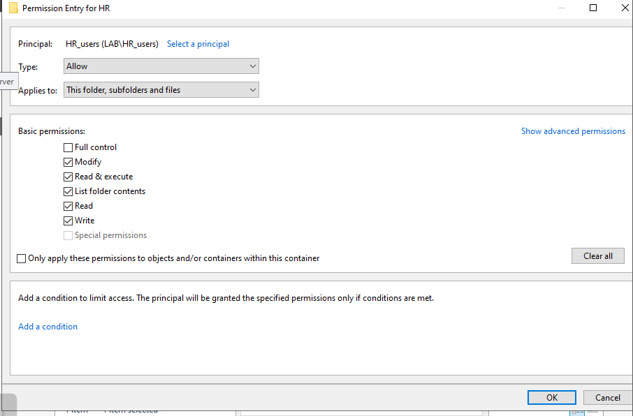

# Secure Department File Share

## Summary

Built an SMB file share for confidential Human Resources data and protected it with Active Directory group membership, share permissions and NTFS permissions.

| Item | Details |
|---|---|
| Server | Windows Server 2022 |
| Client | Domain-joined Windows 11 |
| Domain | `lab.local` |
| Folder | `C:\Shares\HR` |
| Share | `HRShare` |
| Access group | HR |
| Security model | Group-based least privilege |

## Business requirement

HR required a central location for employee records. Authorised HR users needed access across the network, while users outside the department had to be prevented from reading the confidential data.

## Implementation

### 1. Prepare the folder structure

Created the HR share and an Employee Records subfolder, then added a sample `salary-review.txt` file for access testing.

### 2. Publish the SMB share

Shared the folder as `HRShare` so authorised domain users could reach it from client devices.

### 3. Configure share permissions

Removed broad access and assigned the HR security group the required share-level permissions.

### 4. Configure NTFS permissions

Applied NTFS permissions to the underlying folder so the effective access remained restricted at the file-system layer as well as the share layer.

## Access model

Permissions were assigned to the HR security group rather than directly to individual accounts. Effective network access is determined by the most restrictive combination of share and NTFS permissions.

## Validation

| Test | Expected | Result |
|---|---|---|
| HR user opens `HRShare` | Access granted | Pass |
| HR user reads the sample record | Access granted | Pass |
| Non-HR user attempts access | Access denied | Pass |
| Permissions reviewed on the server | HR group only | Pass |

## Outcome

The share provided centralised access for HR while preventing unauthorised users from reaching sensitive files. The project demonstrates practical SMB administration, group-based authorisation and layered permission testing.

## Skills demonstrated

SMB file sharing · NTFS permissions · Share permissions · Active Directory groups · RBAC · Least privilege · Access testing · Windows Server administration

[Back to Windows Server projects](../)
