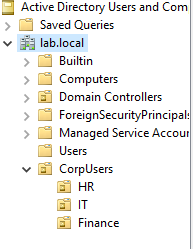
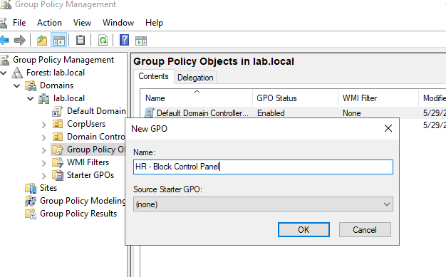
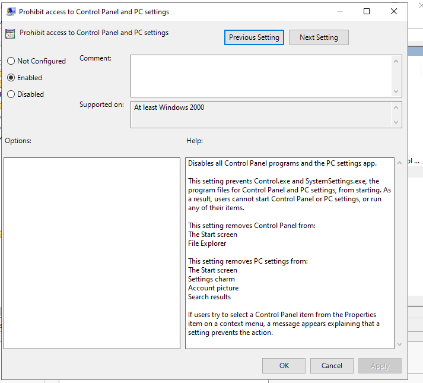
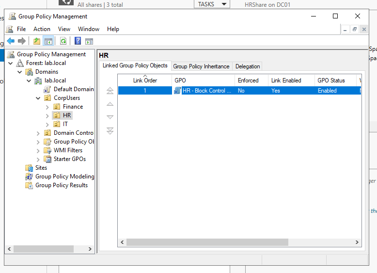
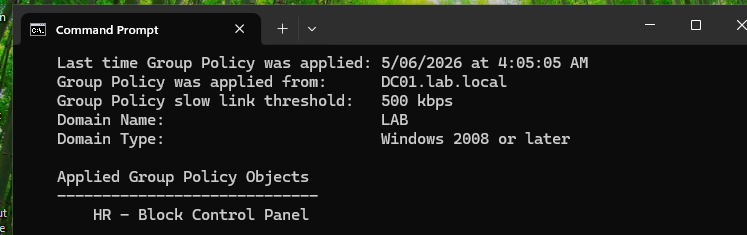
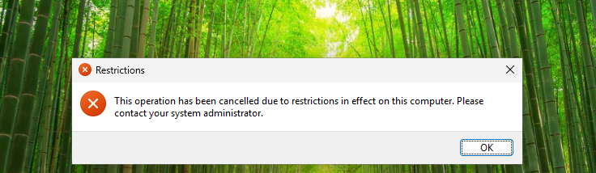

# Case Study 03 – Group Policy Management
### Enterprise Workstation Restriction & Centralized Policy Deployment

| Category | Windows Server Administration |
|----------|-------------------------------|
| **Technology Stack** | Windows Server 2022, Active Directory Domain Services (AD DS), Windows 11, VMware Workstation |
| **Author** | Abdalla Hussein |
| **Status** | Completed |
| **Last Updated** | July 2026 |

---

## Overview

This case study demonstrates the implementation of centralized workstation management using Group Policy within a Windows Server 2022 Active Directory environment. The objective was to restrict Human Resources users from accessing the Windows Control Panel and Settings application while ensuring that the policy did not affect users in other departments.

A dedicated Group Policy Object (GPO) was created, configured, and linked to the Human Resources Organizational Unit (OU). Policy deployment was validated using native Windows administrative tools, and functional testing was performed to confirm that the restriction was successfully enforced on a Windows 11 domain-joined client.

This project demonstrates core enterprise administration skills including Organizational Unit design, Group Policy management, targeted policy deployment, policy validation, and centralized endpoint management.

---

## Business Scenario

Management identified that Human Resources employees were making unauthorized changes to workstation settings through the Windows Control Panel and Settings application. These changes resulted in configuration inconsistencies and increased support requirements for the IT department.

As the Systems Administrator, the objective was to implement a centralized Group Policy solution that restricted access to the Control Panel and Settings application for Human Resources users while ensuring that users in the Information Technology and Finance departments remained unaffected.

The solution required targeted policy deployment through Organizational Units (OUs) to ensure the restriction applied only to the intended users.

---

## Environment

| Component | Configuration |
|-----------|---------------|
| **Hypervisor** | VMware Workstation |
| **Domain Controller** | Windows Server 2022 |
| **Client Device** | Windows 11 (Domain-Joined) |
| **Domain** | lab.local |
| **Active Directory** | Active Directory Domain Services (AD DS) |
| **Management Tool** | Group Policy Management Console (GPMC) |
| **Organizational Units** | CorpUsers → HR, IT, Finance |

---

## Implementation

### Organizational Infrastructure Prepared

The existing Active Directory environment was prepared to support targeted Group Policy deployment. A dedicated **CorpUsers** Organizational Unit (OU) structure was implemented with separate departmental OUs for Human Resources, Information Technology, and Finance.

The existing Human Resources user account was relocated to the HR Organizational Unit, ensuring that Group Policy could be applied specifically to Human Resources personnel without affecting users in other departments. This organizational structure provides a scalable foundation for centralized policy management and simplifies the administration of department-specific configurations.

**Verification**



*Figure 1. Organizational Unit structure prepared for targeted Group Policy deployment.*

---

### Group Policy Object Created

A dedicated Group Policy Object (GPO) named **HR - Block Control Panel** was created using the Group Policy Management Console (GPMC). Creating a separate GPO for this configuration allows workstation restrictions to be managed independently from other organisational policies, improving maintainability and simplifying future policy administration.

The newly created GPO served as the central management object for enforcing workstation restrictions specific to the Human Resources department.

**Verification**



*Figure 2. Group Policy Object created for Human Resources workstation management.*

---

### Policy Configured

The **HR - Block Control Panel** Group Policy Object was configured to prevent Human Resources users from accessing both the Control Panel and the Settings application.

The policy **Prohibit access to Control Panel and PC settings** was enabled under:

> **User Configuration → Policies → Administrative Templates → Control Panel**

By enabling this policy, users within the target Organizational Unit are prevented from modifying workstation configuration settings, helping maintain standardized system configurations and reducing the risk of unauthorized changes.

**Verification**



*Figure 3. Group Policy configured to prohibit access to Control Panel and PC Settings.*

---

### Group Policy Linked to the Human Resources Organizational Unit

After the policy configuration was completed, the **HR – Block Control Panel** Group Policy Object was linked to the HR Organizational Unit within Active Directory.

Linking the GPO to the Human Resources OU ensured that the workstation restriction applied only to Human Resources users while excluding the Information Technology and Finance departments. This targeted deployment aligned with the business requirement of enforcing department-specific policies without affecting other users across the domain.

**Verification**



*Figure 4. Group Policy Object linked to the Human Resources Organizational Unit.*

---

### Policy Applied and Verified

Following deployment, the Group Policy configuration was applied to the Windows 11 domain-joined client by executing the following command:

```powershell
gpupdate /force
```

This command immediately refreshed both computer and user Group Policy settings, ensuring that the newly deployed configuration was applied without waiting for the default Group Policy refresh interval.

To confirm that the correct Group Policy Object had been applied to the client device, the following command was executed:

```powershell
gpresult /r
```

The results verified that the **HR – Block Control Panel** Group Policy Object had been successfully applied to the Human Resources user account, confirming that the policy deployment was functioning as intended.

**Verification**



*Figure 5. Group Policy updated and verified on the Windows 11 client.*

---

## Validation

The implementation was validated to confirm that the Group Policy Object was correctly deployed and applied to the intended Organizational Unit. Administrative verification was performed using both Group Policy Management Console (GPMC) and Windows command-line tools.

| Validation Item | Result |
|-----------------|--------|
| Group Policy Object created successfully | ✅ Pass |
| Policy configured correctly | ✅ Pass |
| GPO linked to HR Organizational Unit | ✅ Pass |
| Group Policy updated on client device | ✅ Pass |
| `gpresult /r` confirmed policy application | ✅ Pass |
| Deployment targeted only Human Resources users | ✅ Pass |

---

## Functional Testing

Functional testing was performed to verify that the deployed Group Policy successfully restricted access to the Control Panel and Settings application for the Human Resources user account.

| Test Scenario | Expected Result | Actual Result | Status |
|--------------|-----------------|---------------|--------|
| HR user opens Control Panel | Access denied | Access denied | ✅ Pass |
| HR user attempts to open Windows Settings | Access denied | Access denied | ✅ Pass |
| Policy enforcement confirmed after Group Policy update | Restriction active | Confirmed | ✅ Pass |

**Verification**



*Figure 6. Functional testing confirmed that the HR user's access to the Control Panel was successfully restricted.*

---

## Outcome

The implementation successfully deployed a targeted Group Policy that prevented Human Resources users from accessing the Windows Control Panel and Settings application. The policy was centrally managed through Active Directory, applied using Organizational Units, and verified on a Windows 11 domain-joined client.

This project demonstrates the ability to design, deploy, and validate centralized workstation management policies while following enterprise administration practices for targeted policy deployment.

---

## Key Takeaways

- Implemented centralized workstation management using Active Directory Group Policy.
- Applied department-specific restrictions through Organizational Unit targeting.
- Verified successful policy deployment using `gpupdate` and `gpresult`.
- Demonstrated the importance of validating both policy deployment and functional outcomes.
- Reinforced enterprise administration practices by documenting configuration, deployment, and verification activities.

---

## Skills Demonstrated

### Windows Server Administration

- Windows Server 2022 Administration
- Active Directory Domain Services (AD DS)
- Group Policy Management
- Organizational Unit Administration

### Endpoint Management

- Centralized Workstation Configuration
- Policy Deployment
- Configuration Validation
- Windows Client Administration

### Enterprise Administration Practices

- Role-Based Policy Deployment
- Configuration Documentation
- Functional Testing
- Change Verification
- Troubleshooting
