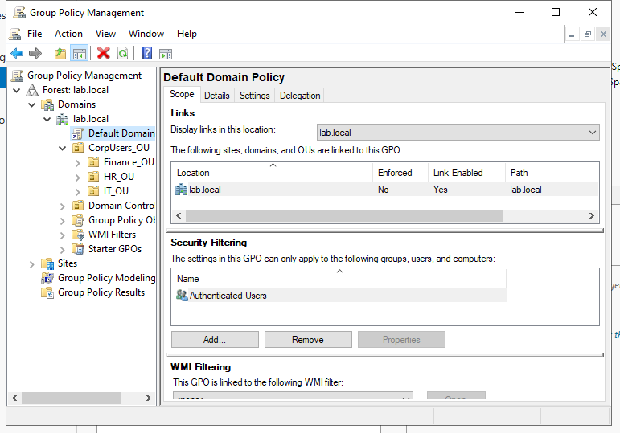
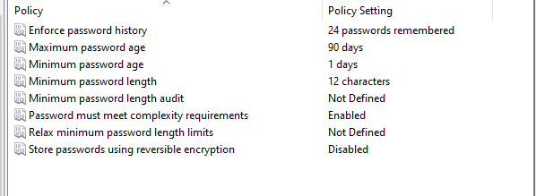
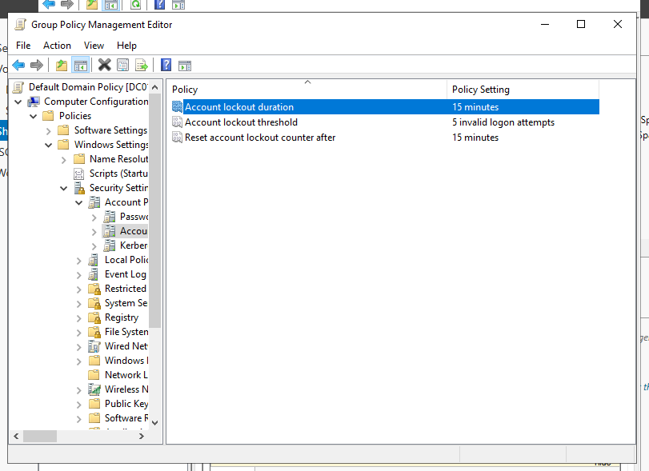
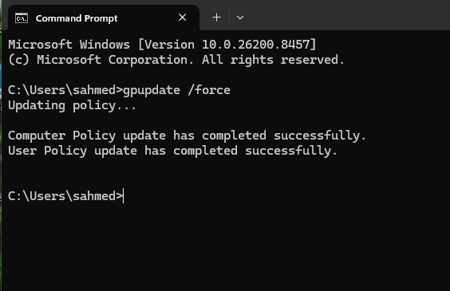
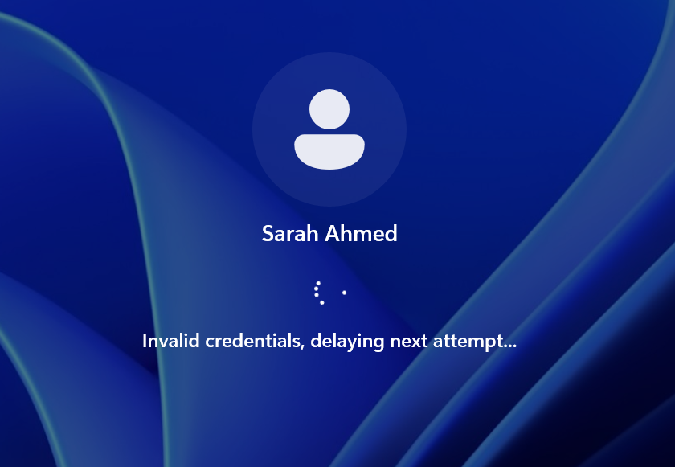
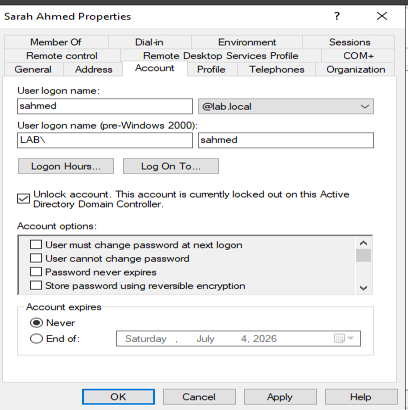

# Case Study 04 – Domain Password Policy Management

**Enterprise Authentication Security & Account Lockout Enforcement**

| | |
|---|---|
| **Category** | Windows Server Administration |
| **Technology Stack** | Windows Server 2022 • Active Directory Domain Services • Windows 11 • VMware Workstation |
| **Author** | Abdalla Hussein |
| **Status** | Completed |
| **Last Updated** | July 2026 |

---

# Overview

This case study demonstrates the implementation of domain-wide password security and account lockout policies using Group Policy within a Windows Server 2022 Active Directory environment. The objective was to strengthen authentication security by enforcing strong password requirements and protecting user accounts against password guessing and brute-force attacks.

The Default Domain Policy was configured to implement password complexity, minimum password length, password expiration, and account lockout settings. The configuration was deployed centrally through Active Directory and validated using a Windows 11 domain-joined client.

This project demonstrates enterprise administration skills including Group Policy management, authentication security, Active Directory administration, policy validation, and centralized identity management.

---

# Business Scenario

Management identified a security risk involving weak passwords and the potential for brute-force attacks against user accounts.

As the Systems Administrator, the objective was to strengthen authentication security by implementing centralized password policies that enforced:

- Strong password requirements
- Password expiration controls
- Account lockout protections

The solution needed to improve domain-wide security while maintaining centralized administration through Group Policy.

---

# Environment

| Component | Configuration |
|------------|---------------|
| Hypervisor | VMware Workstation |
| Domain Controller | Windows Server 2022 |
| Client Device | Windows 11 (Domain-Joined) |
| Domain | lab.local |
| Active Directory | Active Directory Domain Services (AD DS) |
| Management Tool | Group Policy Management Console (GPMC) |
| Policy Target | Default Domain Policy |

---

# Policy Requirements

## Password Policy

- **Minimum Password Length:** 12 Characters
- **Password Complexity:** Enabled
- **Maximum Password Age:** 90 Days

## Account Lockout Policy

- **Account Lockout Threshold:** 5 Failed Logon Attempts
- **Account Lockout Duration:** 15 Minutes
- **Reset Account Lockout Counter After:** 15 Minutes

---

# Implementation

## Existing Infrastructure

This project leveraged the Active Directory environment established during previous homelab projects. The domain infrastructure, including Organizational Units, domain user accounts, and a Windows 11 domain-joined client, was already operational, allowing the focus of this implementation to be on strengthening authentication security through centrally managed Group Policy settings.

By building upon the existing domain infrastructure, password and account lockout policies could be enforced consistently across all domain users without requiring individual workstation configuration.

---

## Default Domain Policy Reviewed

The Default Domain Policy was reviewed prior to modification to establish the existing password and account lockout configuration within the Active Directory domain.

Reviewing the existing policy ensured that authentication settings could be updated in a controlled manner while preserving centralized management through Group Policy. This step also provided a baseline for validating the new security configuration after deployment.

### Verification

**Figure 1.** Default Domain Policy reviewed prior to implementing password security settings.



---

## Password Policy Configured

The Default Domain Policy was configured to enforce enterprise password requirements for all domain users. Centralizing password management through Group Policy ensures authentication standards remain consistent across the environment while reducing the risk of weak or easily compromised credentials.

The Password Policy was configured under:

> **Computer Configuration → Policies → Windows Settings → Security Settings → Account Policies → Password Policy**

The following settings were implemented:

- **Minimum Password Length:** 12 Characters
- **Password Complexity:** Enabled
- **Maximum Password Age:** 90 Days

These settings help strengthen authentication security by requiring users to create complex passwords, maintain an adequate password length, and periodically update their credentials to reduce the risk of unauthorized access.

### Verification

**Figure 2.** Password Policy configured within the Default Domain Policy.



---

## Account Lockout Policy Configured

The Default Domain Policy was further configured to implement account lockout protections for all domain users. These controls help defend against brute-force attacks by temporarily locking user accounts after a defined number of failed authentication attempts.

The Account Lockout Policy was configured under:

> **Computer Configuration → Policies → Windows Settings → Security Settings → Account Policies → Account Lockout Policy**

The following settings were implemented:

- **Account Lockout Threshold:** 5 Invalid Logon Attempts
- **Account Lockout Duration:** 15 Minutes
- **Reset Account Lockout Counter After:** 15 Minutes

Together, these settings reduce the effectiveness of password guessing attacks while automatically restoring user access after the defined lockout period, maintaining an appropriate balance between security and usability.

### Verification

**Figure 3.** Account Lockout Policy configured to protect against repeated failed logon attempts.



---

## Policy Deployed

After the password and account lockout policies were configured, the updated Group Policy settings were deployed across the Active Directory environment using the following command:

```powershell
gpupdate /force
```

This command immediately refreshed both computer and user Group Policy settings, ensuring that the newly configured authentication policies were applied without waiting for the default Group Policy refresh interval.

The policy refresh was executed on both the Domain Controller and the Windows 11 domain-joined client to ensure that the updated security settings were successfully deployed throughout the environment.

### Verification

**Figure 4.** Group Policy updated following deployment of the password and account lockout policies.



---

# Validation

The implementation was validated to confirm that the password and account lockout policies were correctly configured and deployed across the Active Directory domain. Administrative verification was performed using Group Policy Management Console (GPMC) and functional testing on a Windows 11 domain-joined client.

| Validation Item | Result |
|-----------------|--------|
| Password complexity enabled | ✅ Pass |
| Minimum password length configured | ✅ Pass |
| Maximum password age configured | ✅ Pass |
| Account lockout threshold configured | ✅ Pass |
| Account lockout duration configured | ✅ Pass |
| Group Policy successfully deployed | ✅ Pass |

---

# Functional Testing

Functional testing was performed using a test domain user account to verify that the configured account lockout policy operated as expected following deployment.

The following test procedure was completed:

1. Logged into the Windows 11 domain-joined client.
2. Entered an incorrect password five consecutive times.
3. Confirmed that the account became locked.
4. Verified that authentication was denied.
5. Unlocked the account using **Active Directory Users and Computers**.
6. Successfully authenticated using the correct password to confirm that the account recovery process had restored normal access.

| Test Scenario | Expected Result | Actual Result | Status |
|---------------|-----------------|---------------|--------|
| Five consecutive failed logon attempts | Account locked | Account locked | ✅ Pass |
| Authentication after account lockout | Access denied | Access denied | ✅ Pass |
| Account unlocked in Active Directory | User account restored | Successful | ✅ Pass |

The successful recovery of the test account confirmed that the configured account lockout policy functioned as expected while allowing administrators to restore user access through Active Directory Users and Computers when required.

### Verification

**Figure 5.** Functional testing confirmed successful account lockout after five failed authentication attempts.



**Figure 6.** Administrator restored the locked user account using Active Directory Users and Computers.



---

# Outcome

The implementation successfully strengthened authentication security within the Active Directory environment by enforcing centralized password and account lockout policies through Group Policy.

Testing confirmed that strong password requirements, password expiration settings, and account lockout protections operated as expected across the domain. Administrative recovery procedures were also successfully validated, demonstrating that user access could be securely restored when required.

This project demonstrates practical experience implementing enterprise authentication policies, managing Group Policy Objects, validating security configurations, and administering Active Directory within a Windows Server environment.

---

# Key Takeaways

- Implemented domain-wide password and account lockout policies using Group Policy.
- Strengthened authentication security through centralized policy management.
- Validated policy deployment using Group Policy Management Console (GPMC) and functional testing.
- Verified account lockout behaviour and administrative recovery using Active Directory Users and Computers.
- Reinforced best practices for enterprise identity and access management within an Active Directory environment.

---

# Skills Demonstrated

- Active Directory Domain Services (AD DS)
- Group Policy Management (GPMC)
- Windows Server 2022 Administration
- Identity and Access Management (IAM)
- Enterprise Authentication Security
- Password Policy Management
- Account Lockout Configuration
- Security Policy Validation
- Windows 11 Administration
- Technical Documentation
